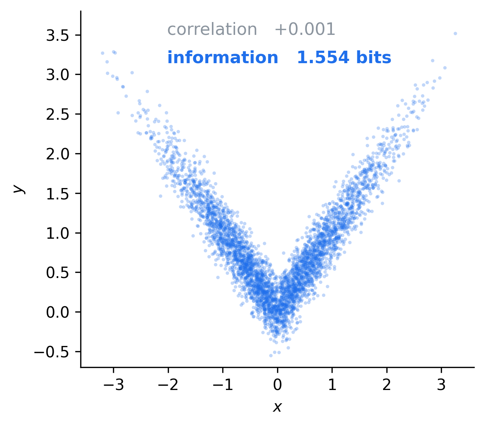
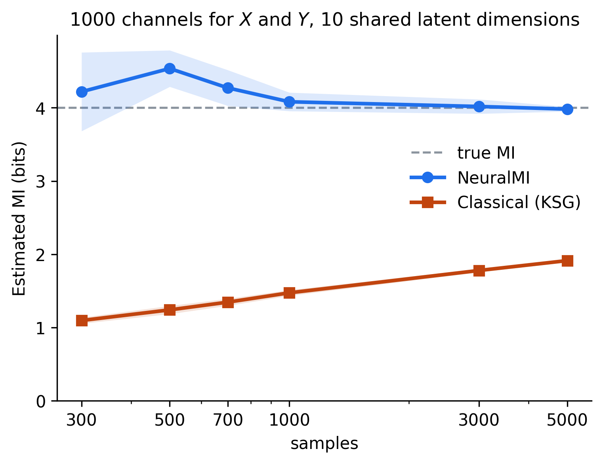
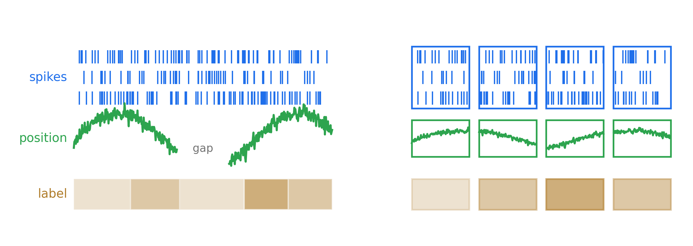
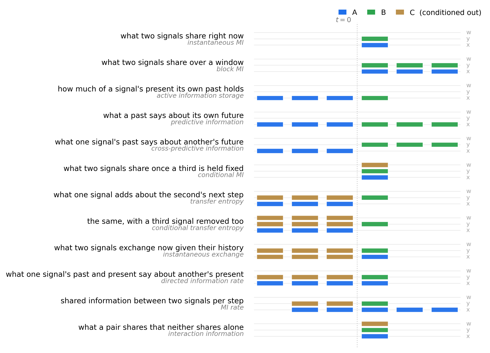

# NeuralMI: mutual information estimation for neural data

[](https://eslam-abdelaleem.github.io/NeuralMI/)
[](https://opensource.org/licenses/MIT)
[](https://github.com/eslam-abdelaleem/NeuralMI/actions/workflows/tests.yml)

**NeuralMI brings information-theoretic analysis to the scale of modern neuroscience using neural-network-based information estimators.**




Correlation is the usual way to ask whether two signals are related, but it is
blind to any nonlinear relationship. For example, a Gaussian folded about zero has a perfect relationship between $x$ and $y$, yet the correlation is zero because the two halves of the linear trend cancel exactly.


Mutual information sees that relationship because it captures linear and nonlinear dependencies alike. It also answers questions a
correlation has no form for, such as how much a population's past says about its own future, what one area adds about another beyond what that area already predicts of itself, or what a pair of signals carries that neither carries alone.




The obstacle to applying information-theoretic measures to large, multimodal neuroscience datasets is the curse of dimensionality. Classical estimators need samples in proportion to the dimensions they are handed, so past ~10 dimensions they outrun any recording of realistic size. Information-theoretic analysis has mostly been limited to a handful of channels for that reason.

Neural-network-based estimators overcome this by learning a map into a low-dimensional embedding while estimating the information in it. The samples needed then follow the latent structure of the data and not the channel count it arrived on.


Giving each modality its own encoder also lets spike times, tracked trajectories and trial labels be analysed
together on one timeline, each in its own subspace and through an encoder with its own inductive bias.




Once estimation is possible at that scale, the whole family of information
quantities can be estimated from a single primitive. Every quantity here is
the same conditional mutual information $I(A;B \mid C)$ under a different choice
of inputs and time offsets.



## Installation

<!-- install-start -->
> **Jupyter / Colab users:** prefix each shell command with `!`.

```bash
git clone https://github.com/eslam-abdelaleem/NeuralMI.git
cd NeuralMI

pip install .

# Optional parts, which combine, as in ".[viz,tutorials]":
#   pip install ".[viz]"        # PCA, t-SNE and UMAP plots of the embeddings
#   pip install ".[vision]"     # pretrained image networks as encoders
#   pip install ".[tutorials]"  # JupyterLab and benchmark-mi, to run the tutorials
#   pip install ".[docs]"       # the docs toolchain (building also needs pandoc)
#   pip install ".[test]"       # the test suite

# Developers (editable install with all of the above):
pip install -e ".[dev]"
```
<!-- install-end -->


## Quickstart

<!-- quickstart-start -->
```python
import neural_mi as nmi
from neural_mi import Model, Split, Training

x, y = nmi.generators.generate_correlated_gaussians(
    n_samples=1000, dim=5, mi=2.0, seed=0)

result = nmi.run(
    x, y,
    mode='estimate',
    model=Model(embedding_dim=16, hidden_dim=128),
    training=Training(n_epochs=100, batch_size=128, patience=20),
    split=Split(mode='random'),   # for independent samples
    seed=0,
)

print(f"estimate : {result.mi_estimate:.3f} bits")
print(f"exact    : 2.000 bits")
```

```
estimate : 2.077 bits
exact    : 2.000 bits
```
<!-- quickstart-end -->

## Tutorials

| notebook | what it covers |
|---|---|
| [01 Why information](tutorials/01_Why_Information.ipynb) | What MI sees that correlation does not and where classical estimators stop working |
| [02 Your first number](tutorials/02_Your_First_Number.ipynb) | What an estimate is and what governs its accuracy |
| [03 Which quantity](tutorials/03_Which_Quantity.ipynb) | Twelve quantities as one $I(A;B \mid C)$ primitive under different offset patterns |
| [04 Preparing your data](tutorials/04_Preparing_Your_Data.ipynb) | What the processors do to your data |
| [05 Choosing the estimator and the architecture](tutorials/05_Estimator_And_Architecture.ipynb) | How to supply an encoder of your own |

## Further reading

| document | answers |
|---|---|
| [`USING.md`](reference/USING.md) | how to call each analysis and read what comes back |
| [`PARAMETERS.md`](reference/PARAMETERS.md) | every setting, with its default |
| [`THEORY.md`](reference/THEORY.md) | what the numbers mean and why the estimators behave as they do |
| [`MESSAGES.md`](reference/MESSAGES.md) | what a warning the library printed means |
| [`ANATOMY.md`](reference/ANATOMY.md) | what an estimator is, built from scratch in PyTorch |
| [`INTERNALS.md`](reference/INTERNALS.md) | where the code lives and how to extend it |
| [`TESTING.md`](reference/TESTING.md) | what the test suite covers |

## Citing

If you use NeuralMI, please cite
[Abdelaleem et al., 2025](https://arxiv.org/abs/2506.00330). GitHub's "Cite this
repository" button gives the entry, from [`CITATION.cff`](CITATION.cff).

## Questions and problems

See the [issue tracker](https://github.com/eslam-abdelaleem/NeuralMI/issues).

## Contributing

See [`CONTRIBUTING.md`](CONTRIBUTING.md).

## License

See [`LICENSE`](LICENSE).
